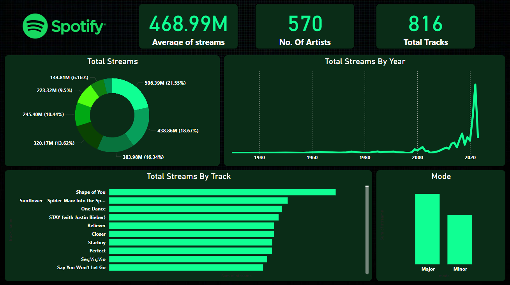

# 🎧 Spotify Streams Power BI Dashboard

This Power BI dashboard presents key insights into Spotify streaming data across tracks, artists, and years. It visualizes total streams, trends over time, and distribution across musical modes (major/minor).

---

## 📌 Overview

The dashboard includes the following elements:

- 📊 **Average Streams** across all tracks (468.99M)
- 🎤 **Total Number of Artists** (570)
- 🎵 **Total Tracks Analyzed** (816)
- 🥁 **Total Streams by Track**
- 📆 **Stream Trends by Year**
- 📈 **Donut Chart: Total Streams by Segment**
- 🎼 **Distribution of Tracks by Mode** (Major vs Minor)

---

## 📸 Dashboard Screenshot

---

## 🔍 Insights Gained

- **"Shape of You"** is the top streamed track.
- Most streams come from a handful of top tracks, evident in the donut chart.
- Streaming activity increased significantly after **2010**, peaking around **2020**.
- **Major mode** tracks dominate over **minor mode**, indicating a preference for upbeat tonality.
- A notable number of artists are contributing to Spotify’s vast library of tracks.

---

## 🛠️ Tools Used

- **Power BI Desktop**
- **Excel Dataset – Spotify Streaming**
- **Data Visuals**: Donut chart, bar chart, line chart, KPIs
